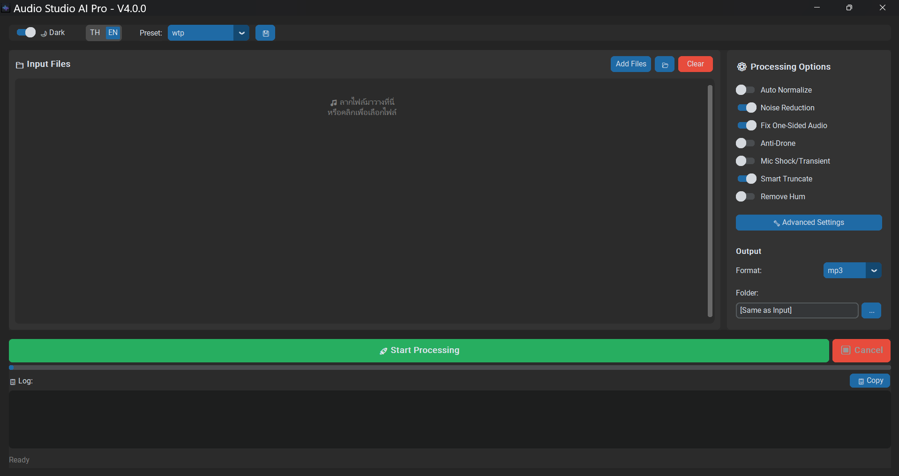
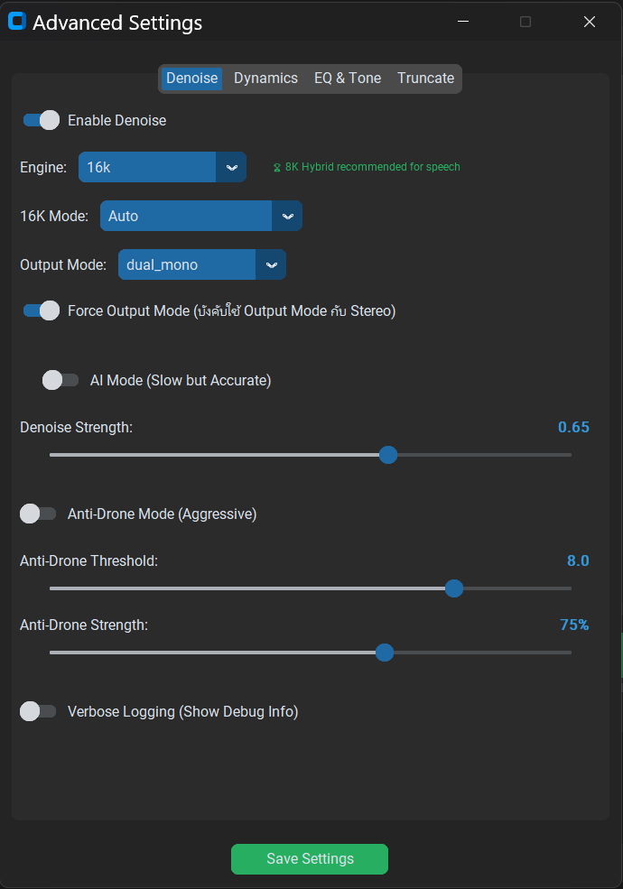
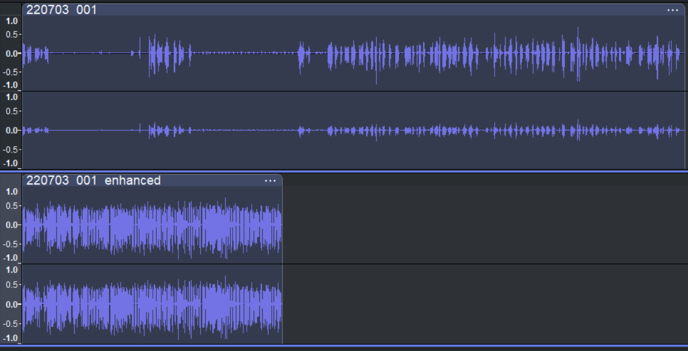

# Audio Studio AI Pro

[](https://python.org)
[](LICENSE)

**Professional Audio Enhancement Tool** with AI-powered noise reduction for forensic and podcast audio.



## ✨ Features

- 🎙️ **Multiple Denoise Engines**
  - 8K Hybrid Engine (OMLSA + AI)
  - 16K V3 Engine with Auto/Fast/Standard modes
  - Fallback to noisereduce

- 🎛️ **Smart Processing**
  - **16K Fast (V18)**: Recommended - best quality and speed
  - Auto mode: analyzes noise floor and selects best algorithm
  - 2-Pass mode: for high-noise recordings
  - Post-Process Cleanup (V19): Digital Black for clean silence

- 🔊 **Audio Enhancement**
  - Anti-drone (low frequency noise removal)
  - De-hum (electrical noise)
  - High-frequency hiss reduction
  - Dynamics processing (gate, compressor, limiter)
  - Smart silence truncation

- 🖥️ **Modern GUI**
  - Dark/Light theme
  - Thai/English language
  - Drag & drop files
  - Preset management
  - Real-time logging

## 📸 Screenshots

### Advanced Settings
Configure denoise engine, strength, and processing options.



### Before & After
Comparison of original vs enhanced audio waveform.



## 📦 Installation

### Requirements
- Python 3.10+
- Windows 10/11, Linux, or macOS

### Quick Start
```bash
# Clone repository
git clone https://github.com/dhammawatthumpra-coder/audio-studio-ai-pro.git
cd audio-studio-ai-pro

# Install dependencies
pip install -r requirements.txt

# Run
python gui_enhancer_v4.py
```

## 🎚️ 16K Engine Modes

| Mode | Description | Best For |
|------|-------------|----------|
| **Fast (V18)** | V18 Smart - **recommended** | General use, best quality |
| Auto | Analyzes noise and auto-selects | Unknown noise level |
| Standard (V12) | Digital Black + CRNN | Clean audio |
| Reduce Hiss (V14) | V12 + HF reduction | Sibilant noise |
| High Noise (2-Pass) | V7 → V12 | Noisy recordings |
| Noise+Hiss (2-Pass+HF) | V7 → V14 | Very noisy + hiss |

## 📁 Project Structure

```
audio-studio-ai-pro/
├── gui_enhancer_v4.py     # Main GUI application
├── audio_processor.py     # Core processing pipeline
├── config_manager.py      # Settings & presets
├── constants.py           # Configuration & language
├── 8k/                    # 8K Hybrid Engine
│   └── core/              # Models & processors
├── 16k_v3/                # 16K V3 Engine (Recommended)
│   ├── core/              # CRNN models
│   ├── audio_processor_v12_blended.py
│   ├── audio_processor_v14_combined.py
│   ├── audio_processor_v18_smart.py   # Fast mode
│   ├── audio_processor_v19_cleanup.py # Post-Process
│   └── enhance.py         # CLI tool
├── presets/               # User presets
└── docs/                  # Screenshots
```

## 🛠️ Build Standalone EXE

```bash
# Install PyInstaller
pip install pyinstaller

# Build
pyinstaller build.spec

# Output: dist/AudioStudioAIPro.exe
```

## 📜 License

MIT License - see [LICENSE](LICENSE) for details.

## 🙏 Credits

- CRNN + GRU + Attention model for speech detection
- OM-LSA algorithm for noise estimation
- noisereduce library as fallback

